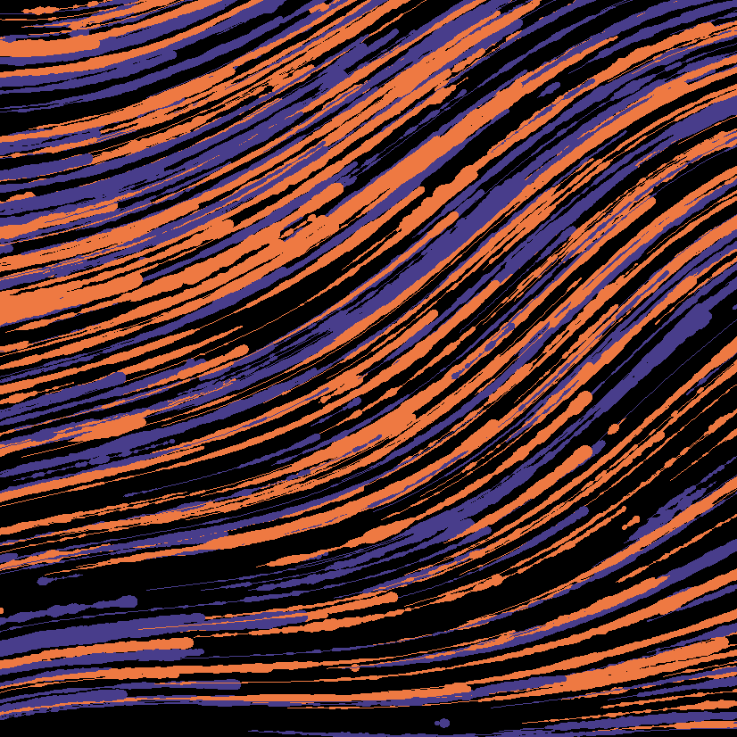

## **Bucknell Artwork**

```{r, include = FALSE}
library(aRtsy)

set.seed(11)
bucknell = canvas_flow(colors = c("darkslateblue", "sienna2"), lines = 1000, background = "black", lwd = .4)

```



## **Colored Squares Artwork**

```{r, include = FALSE}
artwork1 = canvas_squares(colors = c("deeppink2", "mediumorchid3", "midnightblue", "mediumturquoise", "seagreen3", "sienna1"), ratio = 2, cuts = 200, background = "white")
```


## **Vibrant Threads Artwork**

```{r, include = FALSE}
formula <- list(
  x = quote(x_i^2 - sin(y_i^2)),
  y = quote(y_i^3 - cos(x_i^2)))
artwork2 = canvas_function(colors = c("hotpink1", "royalblue1", "midnightblue", "mediumorchid3", "hotpink4"), formula = formula, background = "black")
```


