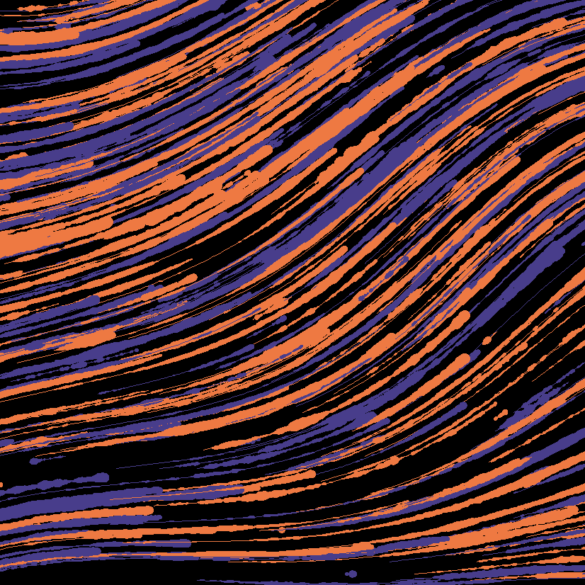
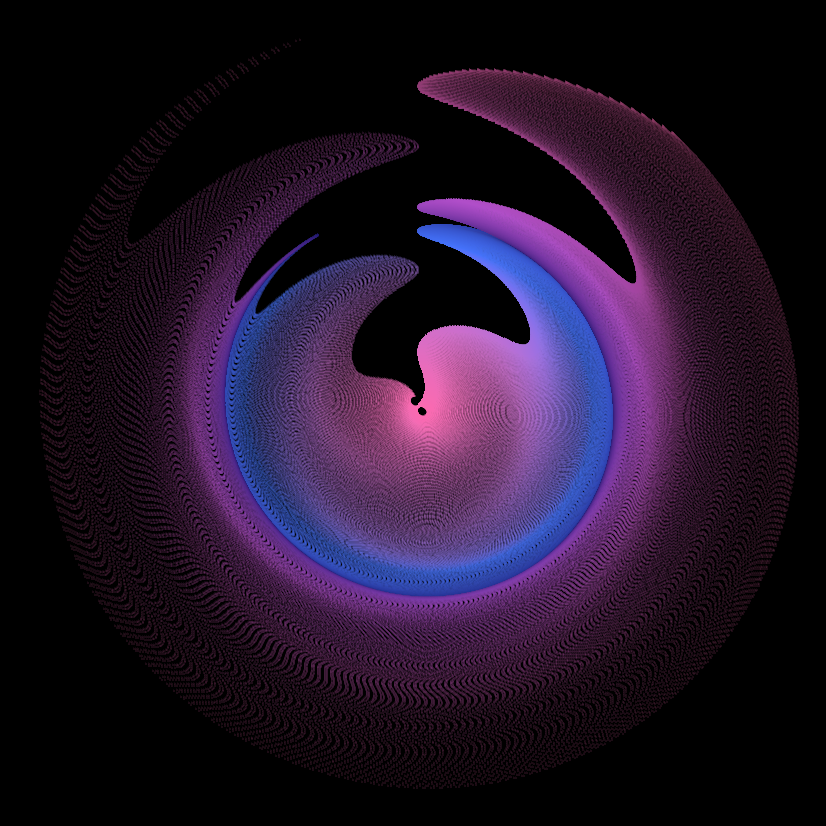

```{r, include = FALSE}
library(aRtsy)
library(distill)
set.seed(11)
bucknell = canvas_flow(colors = c("darkslateblue", "sienna2"), lines = 1000, background = "black", lwd = .4)
```



```{r, include = FALSE}
artwork1 = canvas_squares(colors = c("deeppink2", "mediumorchid3", "midnightblue", "mediumturquoise", "seagreen3", "sienna1"), ratio = 2, cuts = 200, background = "white")
```


```{r, include = FALSE}
formula <- list(
  x = quote(x_i^2 - sin(y_i^2)),
  y = quote(y_i^3 - cos(x_i^2)))
artwork2 = canvas_function(colors = c("hotpink1", "royalblue1", "midnightblue", "mediumorchid3", "hotpink4"), formula = formula, background = "black")
```



```{r, message = FALSE, warning = FALSE}
library(Lock5Data)
library(ggside)
library(ggplot2)
data(SleepStudy)
attach(SleepStudy)

ggplot(SleepStudy, aes(PoorSleepQuality, StressScore, color = AlcoholUse)) +
  geom_point(size = 2) +
  xlab("Poor Sleep Quality") +
  ylab("Stress Score") +
  ggtitle("Poor Sleep Quality vs Stress Score and Alcohol Use - Density & Box") +
  labs(color = "Alcohol Use") +
  geom_ysidedensity(position = "stack") +
  theme(axis.text.x = element_text(angle = -90), ggside.panel.scale = .3) +
  geom_xsideboxplot(aes(y = AlcoholUse), orientation = "y") +
  scale_xsidey_discrete() 
```

https://rconnect.bucknell.edu/content/d99a79a6-2b68-42fa-a948-a58fbe07b00b

```{r}
a = NULL
b = NULL
pop = 1000
samp = 100
num = 100
lev = 0.95
set.seed(4)
data = rnorm(pop)
vec = NULL
for(i in 1:num){
vec[i] = mean(sample(data, samp))
}
CI = NULL
for (i in 1:length(vec)){
  a[i] = vec[i] - qnorm(1 - (1 - lev) / 2)*(1/(samp)^(1/2))
  b[i] = vec[i] + qnorm(1 - (1 - lev) / 2)*(1 / (samp)^(1 / 2))
  CI[i] = a[i] * b[i] < 0
}
tot = NULL
for (i in 1:length(pop)){
  tot[i] = sum(CI[1]:CI[i]) / i
}

val = qnorm(1 - (1 - lev) / 2) * (1 / (samp)^(1 / 2))
qplot(seq_along(vec), vec)+
   geom_point(aes(colour = CI))+
   geom_errorbar(aes(ymin = vec - val, ymax = vec + val,colour = CI))+
   geom_hline(yintercept = 0, color = "black")+
   xlab("Number of Confidence Intervals Generated")+
   ylab("Value")+
   scale_colour_discrete(name="Confidence Interval\n with True Mean")+
   ggtitle(paste("Confidence Level of",lev * 100,"%"))
```

```{r}
data(USStates)
attach(USStates)
ggplot(USStates, aes(x = Region, y = ClintonVote)) +
  geom_violin(scale = "count") +
  guides(fill = "none") + 
  geom_boxplot(width = .1, fill = "black") +
  stat_summary(fun = median, geom = "point", size = 2, color = "white") +
  xlab("Region of the US") +
  ylab("Proportion of votes for Clinton") +
  ggtitle("2016 Presidential Election by Region") +
  scale_x_discrete(limits = c("MW", "NE", "S", "W"), labels = c("Midwest", "East", "South", "West"))
```

